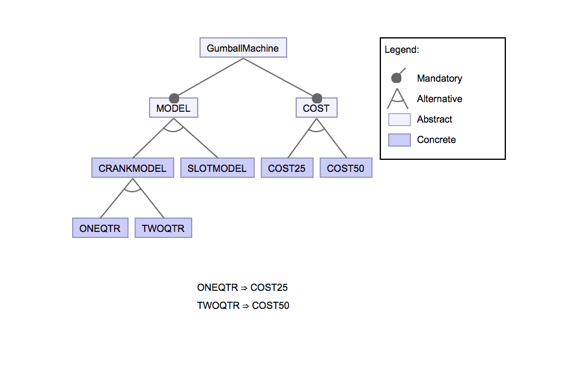

# Lab 10

Lab 1:
- We used generalization to create three gumball machines.
- The input coins and the cost were decided according to the user input in the GumBallMachine class.
- Adding a new functionality to the scenario (eg. input for one dollar) will require a lot of rework.
- In addition, there is less modularity and increased scattered code.

Lab 10:
The shortcomings of the Lab 1 code are overcome here.
- The input coins and the cost are decided according to the user input in the configuration file and the model.xml shown below.
- This induces a modular design and decreased amount of scattered code.
- Therefore, addition of new functionality becomes very easy and includes almost no amount of rework.
- As the user chooses the inputs in the configuration file itself, the validation is guaranteed before running the actual code.

## Model

## Feature Model Configs and outputs

1. Crank Model for 25 cents

2. Crank Model for 50 cents

3. Slot Model for 25 cents

4. Slot Model for 50 cents

